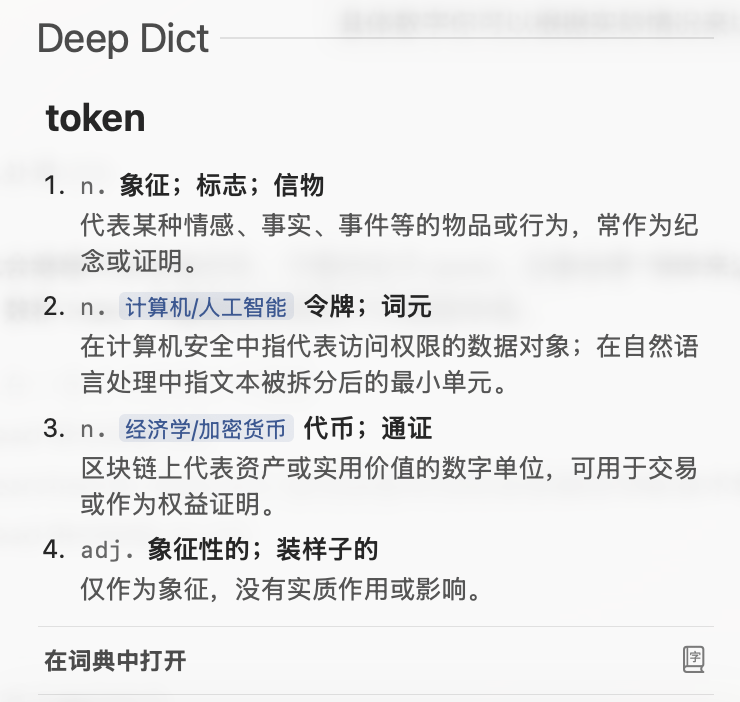

# Deep Dict

[中文说明](README.md)

Deep Dict is an English-Chinese dictionary for macOS Dictionary.app and the system Lookup feature. It is designed primarily for native Chinese speakers who read English frequently, with the goal of providing concise Chinese glosses while minimizing interruption to reading.

Entries were generated in batch with DeepSeek V4 Pro. The current version generated 100,683 candidate entries, of which 91,813 were included in the final dictionary. The generation process used about 257M tokens.

## Installation

Extract `release/DeepDict.dictionary.zip`, then copy `DeepDict.dictionary` to:

```sh
~/Library/Dictionaries/
```

Open Dictionary.app and enable `Deep Dict` in settings.

## Scope

Deep Dict is a reading-aid dictionary, not an encyclopedia or a full English learning dictionary. It is intended for quickly checking meanings while reading English articles, papers, forums, and technical documentation, with short Chinese glosses shown inside the macOS Lookup popup.

It does not aim to cover full etymology, pronunciation, examples, collocations, grammar notes, or encyclopedic entries for people, organizations, brands, products, and events.

## Examples



## Word Sources

The candidate word list combines a broad frequency-based source with public-corpus supplements. The project first extracted about 100,000 English candidate words from word-frequency data and removed items clearly unsuitable as dictionary entries. It then supplemented this base list with terms extracted from LessWrong, the last two years of Hacker News, and Reddit comment corpora, in order to better cover language used in forums, technical communities, and contemporary online discussion. A smaller core English word list was also retained for basic reading coverage.

The goal is not exhaustive English coverage. The goal is to cover words that are likely to appear in real reading contexts and are useful enough to look up.

## Inclusion Policy

This dictionary is not an encyclopedia. Many proper nouns, brands, products, people, companies, and events are intentionally not included. For example, a term such as `DeepSeek` is not necessarily included as a normal dictionary entry; this type of content is better handled by an encyclopedia, Wikipedia, a technical glossary, or a separate proper-noun dictionary.

The inclusion policy prioritizes whether the word affects normal English reading comprehension, whether the model can identify the exact input word reliably, whether a concise and accurate Chinese gloss can be produced, and whether the result works well inside a macOS Lookup popup.

Common, general, and text-relevant senses are listed first. Rare senses are usually not exhaustively included.

## Reproduction and Build

Install dependencies and generate entries:

```sh
python3 -m venv .venv
source .venv/bin/activate
pip install -r requirements.txt
export DEEPSEEK_API_KEY="..."
python scripts/generate_entries.py --workers 64
```

Building the macOS dictionary requires Apple's Dictionary Development Kit:

```sh
python scripts/build_apple_dictionary_source.py --entries-dir outputs/entries-merged-clean --output-dir build/deep-dict --dict-name "Deep Dict" --package-name DeepDict --display-name "Deep Dict" --bundle-id org.deepdict.dictionary.en-zh --manufacturer "Deep Dict Project" --xml-name DeepDict.xml --clean
make -C build/deep-dict DICT_BUILD_TOOL_DIR="/path/to/Dictionary Development Kit"
make -C build/deep-dict install
```

## Repository Layout

- `prompts/entry-generation-system.md`: entry-generation prompt.
- `scripts/`: word-list extraction, entry generation, and Apple Dictionary build scripts.
- `data/generation-targets/merged-clean/words.csv`: production candidate word list.
- `data/final-wordlists/included-words.csv`: final included headword list.
- `release/`: current release artifacts.

## Open Source Note

Entries are generated by an LLM and should not be treated as authoritative professional lexicographic data. Before a formal open-source release, the project still needs explicit licenses for code, generated data, and release artifacts.
